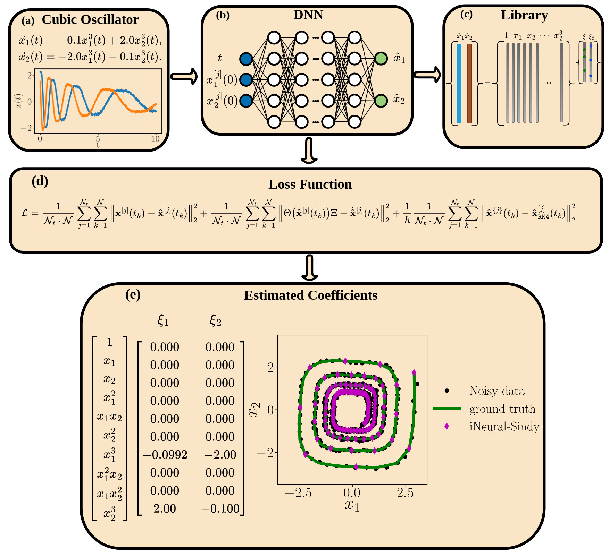

# I-NeuralSINDy: Integrating schemes and neural networks assisted SINDy approach

**iNeuralSINDy** is a nonlinear system identification approach that combines deep learning and integration scheme to deal with the problem of noisy as well as small data sets.




# Introduction
**iNeuralSINDy** in particular took advantage of `SINDy` algorithm [Brunton et al.](https://www.pnas.org/doi/10.1073/pnas.1517384113) to build a dictionary suitable to discover active terms that play main role in the evolution of the dynamical systems. Real and practical scenarios are considered in the setting such as dealing with noise, and multi trajectories temporal date set. The reason to have multi trajectories assumption is that the dynamical systems often commence their evolution from different initial conditions which make the measured data set complex. A Deep Neural Network structure is utilized to model the nonlinear mapping relation between the time and multi trajectories data set.

With the usage of automatic differentiation, combined with a regression-based regularization, the approximation of the temporal derivatives in noisy data will be strongly enhanced. By doing this, we combine the advantage of (i) regression-based approach to model discovery [Rudy et al.](https://www.science.org/doi/10.1126/sciadv.1602614) and (ii) the ability of neural networks to infer system parameters in the context of Physics Informed Neural Networks [Raissi et al.](https://www.sciencedirect.com/science/article/pii/S0021999118307125), [GijsVermarien et.al](https://github.com/PhIMaL/DeePyMoD).


Runge-Kutta integration scheme [Goyal et al.](https://royalsocietypublishing.org/doi/full/10.1098/rspa.2021.0883) is applied to overcome the challenge of obtaining accurate estimates of derivative information in classical `SINDy` algorithms. Incorporating the information contained in the integral of the data into the sparse regression model will help to reduce the impact of noise in the data set. 

The cost function in **iNeuralSINDy** has been considered as the linear combination of three terms including gradient descent term for Deep Neural Network training, the integration term, and a term that promotes identified coefficients of the candidate ODE. 

## What types of models can you discover?
**iNeuralSINDy** can discover non-linear, multi-dimensional and/or coupled ODEs. See  the examples folder for a demonstration of each.

## Contains
- `Examples` folder contains all the examples considered in the paper. The results generated from these examples will be saved in the Result folder.
- `Functions` folder contains externalized Python modules that are used to prepare the package.

## Usage
The file `environment.yml` contains all the dependencies that are required to use Python package.

The package has been prepared in Python version `python 3.10.6` 

To create a virtual `conda` environment use the following syntax: 
```bash
conda env create -f environment.yml 
```
`environment.yml` contains all the dependencies and their versions. Default name of the environment is `iNeuralSINdy`.

3 modules has been allocated for each dynamical system, e.g. consider `cubic oscillator`, module `Cubic_Oscilator.py` identifies cubic oscillator from a given noisy data set; module `Cubic_Oscilator_different_samples.py` performs sensitivity analysis corresponding to fixed Deep Neural Network structure with variable sample size; module `Cubic_Oscilator_different_neurons.py` performs sensitivity analysis corresponding to fixed sample size with variable Deep Neural Network structure.


A Spyder IDE by deafult will be installed with the conda environment. When you `activate` the conda environemnt then type `spyder` so an instance of the the IDE will pop-up.

#### Generating images and reproducability

Generally three types of figures are inside the draft. The first type of figures is like 6, and 7 which we only simulate based on each level of noise. To generate these images for each example you should run e.g. `Cubic_Oscilator.py` to generate images like 6, and 7 with setting associated noise level with parameter e.g. `noise_level=0.02`. 
In image 6 for instance we compare `iNeuralSINDy` with other approaches with different noise level. In image 7 we show the convergence of the coefficients. For the other examples we have the same setup. Please bear in mind simulation takes some minutes.

The second type of figures is like 8 that we compare the performance of `iNeuralSINDy` with `DeePyMoD` with fixed Neural Network structure and various number of samples e.g. `num_samples = [30, 40, 50, 100, 200, 300, 400]` which is named in the draft with `Scene_A`. In this regard you should run `Cubic_Oscilator_different_samples.py` and see the `heatmap` plot. For the other examples we have the same setup. Please bear in mind simulation takes a few hours.

The third type of figures is like 9 that we compare the performance of `iNeuralSINDy` with `DeePyMoD` with fixed number of samples and various number of neurons e.g. `num_hidden_neur = [2, 4, 8, 16, 32, 64]` which is named in the paper draft with `Scene_B`. In this regard you should run `Cubic_Oscilator_different_neurons.py` and see the `heatmap` plot. For the other examples we have the same setup. Please bear in mind simulation takes a few hours.

For `Lorenz system` we have considered to do the simulations slightly different with setting `scaling factor= 0.1, 1`. The rest is similar as mentioned.


Here it is a simple example for input setting to identify cubic oscillator dynamical system:
```python

@dataclass
class ParametersSetting:
    
    t_max = 10
    t_min = 0
    num_samples = 801
    num_init_cond = 2
    num_indp_var = 2
    min_init_cond = 1
    max_init_cond = 4
    poly_order = 3
    fun_scaling_factor = 1
    max_iterations = 30000
    write_iterations = 5000
    threshold_iteration = 15000
    threshold_value = 0.05
    shuffle = False
    save_model_path: str = "./Results/Cubic_Oscilator/"
    add_noise: bool = True
    noise_level = [0.00]
    useRK = [True, False]
    useNN = [True, False]
    tikz_save: bool = False
    name_pic_loss: str = "Cubic_Oscilator_loss_noise_"
    name_pic_data: str = "Cubic_Oscilator_training_data_noise_"
    name_pic_comparison: str = "Cubic_Oscilator_noise_"
```

Here is a brief description of the parameters:
- `t_max:` The maximum value of the independent variable (time).
-  `t_min:` The minimum value of the independent variable (time).
-   `num_samples:` The number of samples to generate between `t_min` and `t_max`.
-    `num_init_cond:` The number of initial conditions to generate for the dependent variables.

- `num_indp_var:` The number of independent variables, e.g. [x_1, x_2].

- `min_init_cond:` The minimum value of the initial conditions to generate.
- `max_init_cond:` The maximum value of the initial conditions to generate.
- `poly_order:` The order of the polynomial used for the SINDy dictionary.
- `fun_scaling_factor:` A scaling factor for the model function.
- `max_iterations:` number of epochs.
- `write_iterations:` The number of iterations at which to print the results on the screen.
- `threshold_iteration:` The iteration number that we apply pruning.
- `threshold_value:` The threshold value 
- `shuffle:` Whether or not to shuffle the training data set 

- `save_model_path:` The path to save the SINDy model.
- `add_noise:` Whether or not to add noise to the training data.
- `noise_level:` The level(s) of noise to add to the training data.
- `useRK:` Whether or not to use the RK4-SINDy method.
- `useNN:` Whether or not to use the iNeuralSINDy method.
- `tikz_save:` Whether or not to save the plots in a TikZ format.
- `name_pic_loss:` The name of the file to save the loss plot.
- `name_pic_data:` The name of the file to save the training data plot.
- `name_pic_comparison:` The name of the file to save the comparison plot.

## Where to find us?

Max Planck Institute for Dynamics of Compelx Technical Systems, CSC group, Magdeburg, 39106, Germany.

You can either drop an email to the authors.

Email: forootani@mpi-magdeburg.mpg.de/alifoootani@ieee.org

Email: goyalp@mpi-magdeburg.mpg.de

Email: benner@mpi-magdeburg.mpg.de

## Contributing
Please feel free to clone/download the repository and extend.

